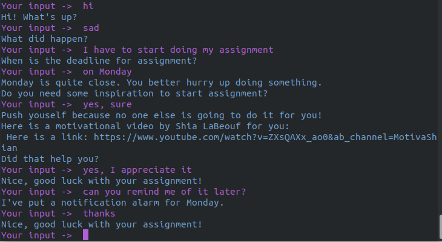

# Conversional Bot Motivator built using Rasa

Motivator can inspire you to start working on your tasks and projects. With the help of motivational quotes, movies and [Shia LaBeouf](https://www.youtube.com/watch?v=ZXsQAXx_ao0&ab_channel=MotivaShian), 
it can charge you with energy and motivation for action.

## Usage Guide

#### 0. Prerequisites
Install all required libraries:
```
pip install -r requirements.txt
```

#### 1. Train a model
```
rasa train
```

#### 2. Run the shell
```
rasa shell
```

#### Optional
Visualize the graph of actions:
```
rasa visualize
```

Run shell in nlu mode:
```
rasa shell nlu
```

## The graph of actions


## A sample conversation

